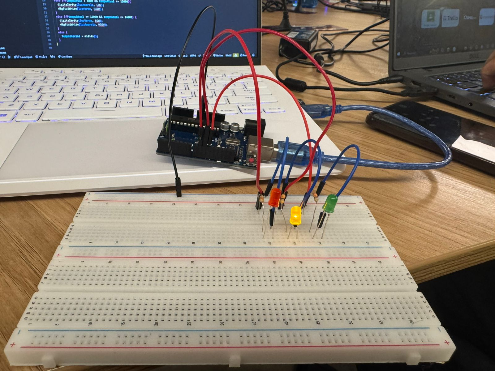

# PonderadaFarolOffline
*Ponderada Arduino - Semana 3 (Projeto Farol)*

*Nome:* Marlos do Carmo Guedes
*Turma:* 12 
*Módulo:* 4 - Engenharia de Software 

### Montagem

Para o projeto de montagem de um semáforo com Arduino, utilizamos componentes simples e uma protoboard para facilitar as conexões. A montagem segue os seguintes passos:

    

### Video Semaforo
Se encontra na pasta images

1. Coloque os LEDs (vermelho, amarelo e verde) na protoboard, com as pernas negativas dos LEDs conectadas a um ponto de terra (GND).
2. Conecte os resistores de 330 Ω nas pernas positivas de cada LEDe.
3. Use os jumpers para ligar cada LED a uma porta do Arduino Uno (9, 10, 11).
4. Conecte o Arduino à alimentação e insira o código para alternar as cores do semáforo.

### Tabela de Bill of Materials

| Quantidade | Descrição               | Especificações     |
|------------|--------------------------|---------------------|
| 1          | LED Vermelho             | -                  |
| 1          | LED Verde                | -                  |
| 1          | LED Amarelo              | -                  |
| 7          | Jumpers                  | (Macho x Macho)    |
| 3          | Resistores               | 330 Ω              |
| 1          | Protoboard               | -                  |
| 1          | Arduino Uno              | -                  |
| 1          | Cabo de Alimentação      | -                  |

### Tabela de Avaliação entre Pares (Avaliação Recebida)

#### Avaliador: Thiago Volcati

|Critério|	Contempla (Pontos)|	Contempla Parcialmente (Pontos)	|Não Contempla (Pontos)	|Observações do Avaliador|
|-|-|-|-|-|
|Montagem física com cores corretas, boa disposição dos fios e uso adequado de resistores	|Até 3	|Até 1,5	|0 | 3 - Atende perfeitamente|	
|Temporização adequada conforme tempos medidos com auxílio de algum instrumento externo	|Até 3	|Até 1,5	|0 | 3 - Atende perfeitamente|	
|Código implementa corretamente as fases do semáforo e estrutura do código (variáveis representativas e comentários) |	Até 3|	Até 1,5 |	0 | 3 - Atende perfeitamente|	
|Ir além: Implementou um componente de extra, fez com millis() ao invés do delay() e/ou usou ponteiros no código |	Até 1 |	Até 0,5 |	0 | 3 - Atende perfeitamente|	
| | | | |Pontuação Total: 10|

### Tabela de Avaliação entre Pares (Avaliado)

#### Avaliado: Thiago Volcati

|Critério|	Contempla (Pontos)|	Contempla Parcialmente (Pontos)	|Não Contempla (Pontos)	|Observações do Avaliador|
|-|-|-|-|-|
|Montagem física com cores corretas, boa disposição dos fios e uso adequado de resistores	|Até 3	|Até 1,5	|0 | 3 - Atende perfeitamente|	
|Temporização adequada conforme tempos medidos com auxílio de algum instrumento externo	|Até 3	|Até 1,5	|0 | 3 - Atende perfeitamente|	
|Código implementa corretamente as fases do semáforo e estrutura do código (variáveis representativas e comentários) |	Até 3|	Até 1,5 |	0 | 3 - Atende perfeitamente|	
|Ir além: Implementou um componente de extra, fez com millis() ao invés do delay() e/ou usou ponteiros no código |	Até 1 |	Até 0,5 |	0 | 3 - Atende perfeitamente|	
| | | | |Pontuação Total: 10|

